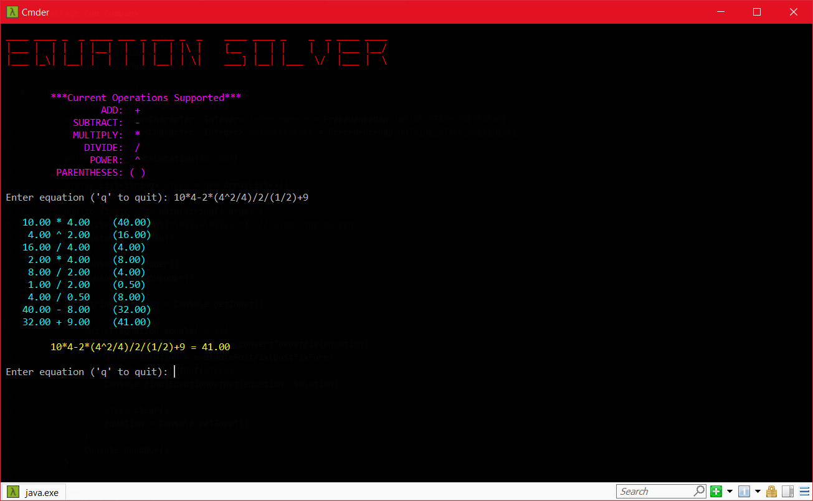

# Equation Solver :books: :pencil2:

### Solve equations using order of operations 
 
* Solved by converting the equation to postfix form and evaluating 
* The equations we are used to is in infix form
    * operand operator operand
    * example: a+b
* postfix form
    * operand operand operator
    * example: ab+  

